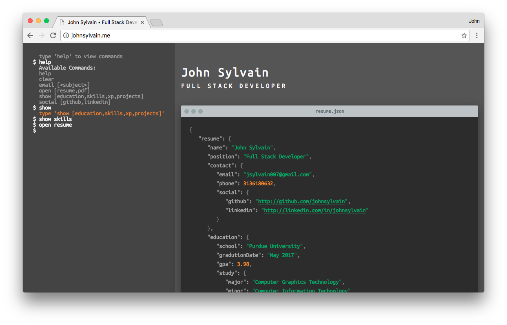

# Command Line Resume

An interactive resume built with vanilla JavaScript.  Users use the terminal on the left to enter commands and interact with the content on the right.  Resume content is displayed in JSON format.

## Screenshot

## Installation

Install [Node.js](http://nodejs.org) on your system and run `npm install` to install all the dependencies.  The dev server can be started with `npm start`.